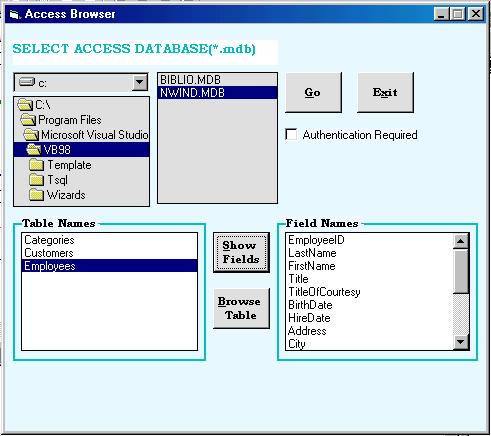



## Access Browser

### Description

This is a nice program for Browsing through the MS Access file i.e. *.mdb. It works quiet fast comparatively. This shows you the number of tables present in the selected Database. Further it will show the fields in the selected table.Theres also a provision for seeing the whole selected table in the grid. Its quiet a good thing for using & even for the users who are not well known with the usage of Access Databases & dealing with the uncertainity tables into it.
 
### More Info
 
The MS Access Name

Set Reference To ADO, DAO if needed.

various properties like the Tables, Fields & Data

             |
---                |---
**Submitted On**   |2003-08-29 15:55:16
**By**             |[Rachit K](https://github.com/Planet-Source-Code/PSCIndex/blob/master/ByAuthor/rachit-k.md)
**Level**          |Intermediate
**User Rating**    |4.7 (14 globes from 3 users)
**Compatibility**  |VB 6\.0, VBA MS Access, VBA MS Excel
**Category**       |[Databases/ Data Access/ DAO/ ADO](https://github.com/Planet-Source-Code/PSCIndex/blob/master/ByCategory/databases-data-access-dao-ado__1-6.md)
**World**          |[Visual Basic](https://github.com/Planet-Source-Code/PSCIndex/blob/master/ByWorld/visual-basic.md)
**Archive File**   |[Access\_Bro164061942003\.zip](https://github.com/Planet-Source-Code/rachit-k-access-browser__1-48071/archive/master.zip)

